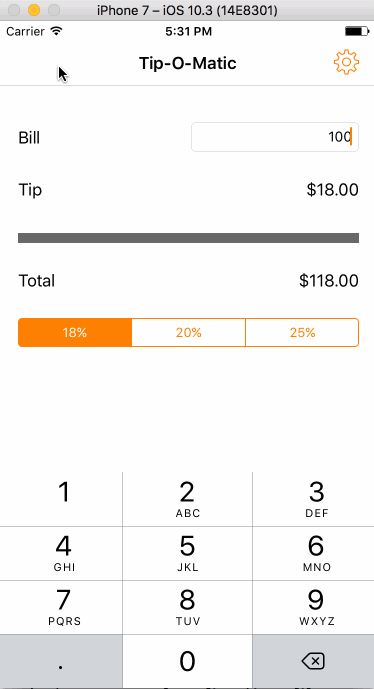

# Pre-work - TipCalculator - Tip-O-Matic

Tip-O-Matic is a tip calculator application for iOS.

Submitted by: Cesar Cavazos 

Time spent: 4 hours spent in total

## User Stories

The following **required** functionality is complete:

* [X] User can enter a bill amount, choose a tip percentage, and see the tip and total values.
* [X] Settings page to change the default tip percentage.

The following **optional** features are implemented:

* [ ] UI animations
* [X] Remembering the bill amount across app restarts (if <10mins)
* [ ] Using locale-specific currency and currency thousands separators.
* [X] Making sure the keyboard is always visible and the bill amount is always the first responder. This way the user doesn't have to tap anywhere to use this app. Just launch the app and start typing.

The following **additional** features are implemented:

- [ ] List anything else that you can get done to improve the app functionality!

## Video Walkthrough 

Here's a walkthrough of implemented user stories:



GIF created with [LiceCap](http://www.cockos.com/licecap/).

## Project Analysis

As part of your pre-work submission, please reflect on the app and answer the following questions below:

**Question 1**: "What are your reactions to the iOS app development platform so far? How would you describe outlets and actions to another developer? Bonus: any idea how they are being implemented under the hood? (It might give you some ideas if you right-click on the Storyboard and click Open As->Source Code")

**Answer:** Every time I jump into Xcode I feel excited, there are plenty of things that it offers and everytime you can discover something new. I would describe an `outlet` as the representation of a UI element in the code and an `action` as the event that a UI element can trigger. I can see that this actions are implemented as follow where the selector is the method that is being executed, the id and the destination seem like an autogenerated id between the ViewController and the Storyboard and the event type is pretty self explanatory.

```
	<connections>
		<action selector="calculateTip:" destination="BYZ-38-t0r" eventType="valueChanged" id="Qcs-kv-ruX"/>
	</connections>
```

Question 2: "Swift uses [Automatic Reference Counting](https://developer.apple.com/library/content/documentation/Swift/Conceptual/Swift_Programming_Language/AutomaticReferenceCounting.html#//apple_ref/doc/uid/TP40014097-CH20-ID49) (ARC), which is not a garbage collector, to manage memory. Can you explain how you can get a strong reference cycle for closures? (There's a section explaining this concept in the link, how would you summarize as simply as possible?)"

**Answer:** A strong reference cycle within a closure happens when you use the `self` within a class without defining a capture list or a weak or unowned reference. This creates a strong reference between the class and the closure itself than even if the instance of the classes is released (set to null) the two-way strong relationship between the class and the closure will not allow it to be freed from memory.

## Notes

Icons from [Icons8/](https://icons8.com/)

## License

    Copyright 2017 Cesar Cavazos

    Licensed under the Apache License, Version 2.0 (the "License");
    you may not use this file except in compliance with the License.
    You may obtain a copy of the License at

        http://www.apache.org/licenses/LICENSE-2.0

    Unless required by applicable law or agreed to in writing, software
    distributed under the License is distributed on an "AS IS" BASIS,
    WITHOUT WARRANTIES OR CONDITIONS OF ANY KIND, either express or implied.
    See the License for the specific language governing permissions and
    limitations under the License.
